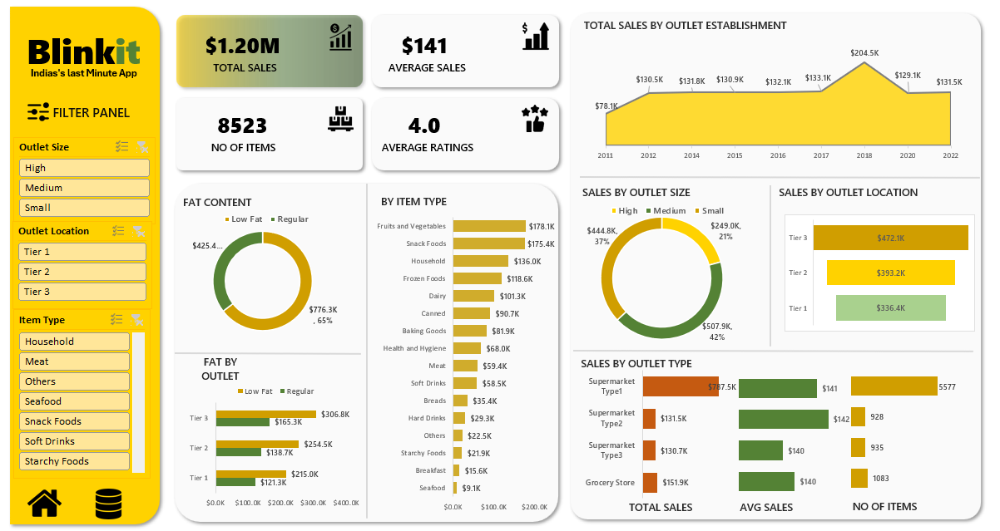

# 📊 **Blinkit Sales Analysis**

## 🏢 **Business Requirement**
To conduct a comprehensive analysis of **Blinkit's sales performance, customer satisfaction, and inventory distribution** to identify key insights and opportunities for optimization using various **KPIs** and visualizations in **Power BI**.

---

## 📌 **KPI Requirements**

1. **Total Sales**: The overall revenue generated from all items sold.
2. **Average Sales**: The average revenue per sale.
3. **Number of Items**: The total count of different items sold.
4. **Average Rating**: The average customer rating for items sold.

---

## 🖼 **Data Insights & Visualization**

---

## 📊 **Charts Requirements & Objectives**

### **1️⃣ Total Sales by Fat Content**
- **Objective**: Analyze the impact of fat content on total sales.
- **Additional KPIs**: Average Sales, Number of Items, Average Rating.
- **Chart Type**: 🥯 Donut Chart.

### **2️⃣ Total Sales by Item Type**
- **Objective**: Identify the performance of different item types in terms of total sales.
- **Additional KPIs**: Average Sales, Number of Items, Average Rating.
- **Chart Type**: 📊 Bar Chart.

### **3️⃣ Fat Content by Outlet for Total Sales**
- **Objective**: Compare total sales across different outlets segmented by fat content.
- **Additional KPIs**: Average Sales, Number of Items, Average Rating.
- **Chart Type**: 📉 Stacked Column Chart.

### **4️⃣ Total Sales by Outlet Establishment**
- **Objective**: Evaluate how the age or type of outlet establishment influences total sales.
- **Chart Type**: 📈 Line Chart.

### **5️⃣ Sales by Outlet Size**
- **Objective**: Analyze the correlation between outlet size and total sales.
- **Chart Type**: 🥧 Donut / Pie Chart.

### **6️⃣ Sales by Outlet Location**
- **Objective**: Assess the geographic distribution of sales across different locations.
- **Chart Type**: 🌍 Funnel Map.

### **7️⃣ All Metrics by Outlet Type**
- **Objective**: Provide a comprehensive view of all key metrics (Total Sales, Average Sales, Number of Items, Average Rating) broken down by different outlet types.
- **Chart Type**: 📑 Matrix Card.

---

📌 **Stay tuned for updates!** 🟢

